# ObCYDian

An [Obsidian](https://obsidian.md)-style markdown notes app for the 3.5" ESP32 "Cheap Yellow Display" (CYD). Your notes are plain `.md` files in folders on a microSD card, linked together with `[[wikilinks]]`. You can write them on the device's touchscreen, with a Bluetooth keyboard, or from any browser over WiFi.

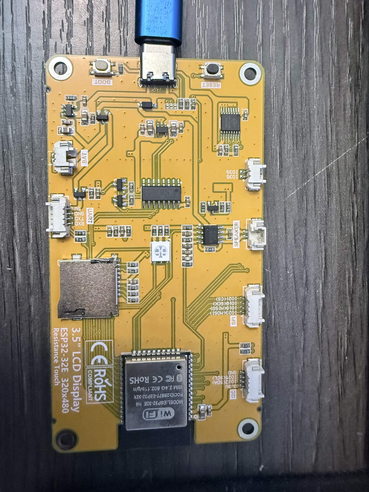

## Screenshots

**On the device** (480×320, shown at 2×)

| | |
|---|---|
|  |  |
| Reading view with frontmatter, links and formatting | Callouts and tap-to-tick tasks |
| 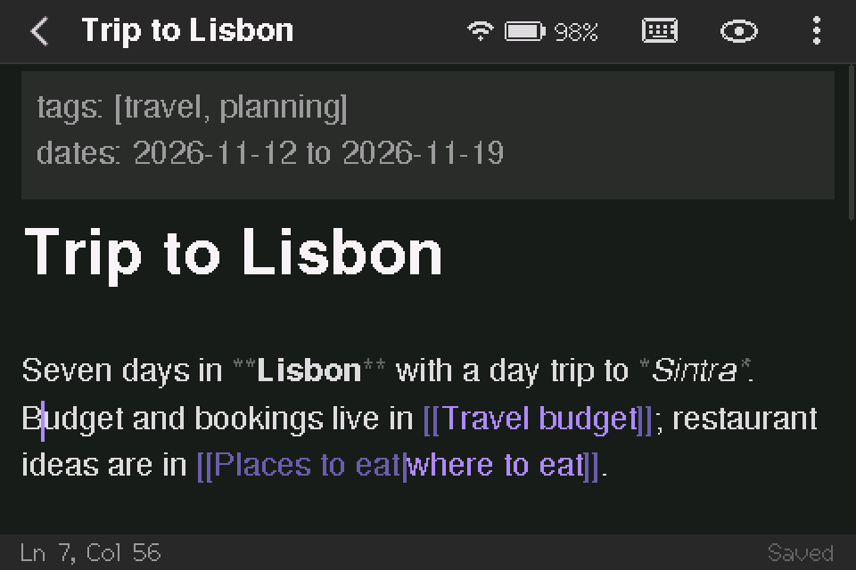 | 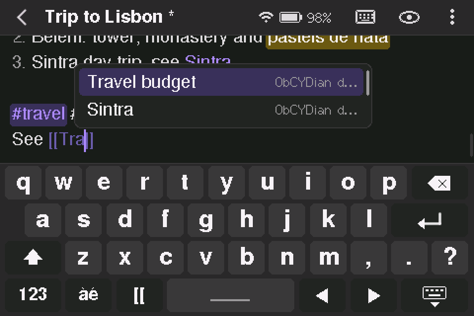 |
| Live preview: markdown is revealed on the cursor line | `[[` link suggestions and the on-screen keyboard |
| 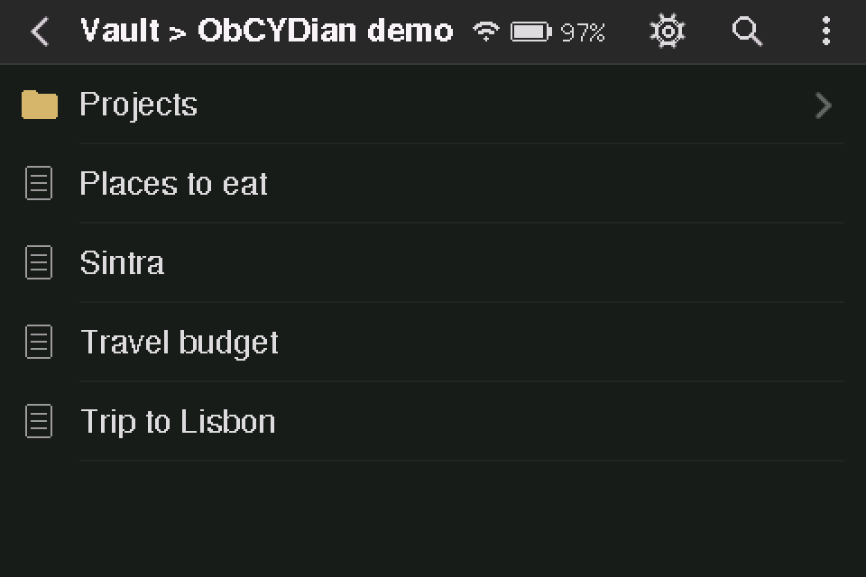 | 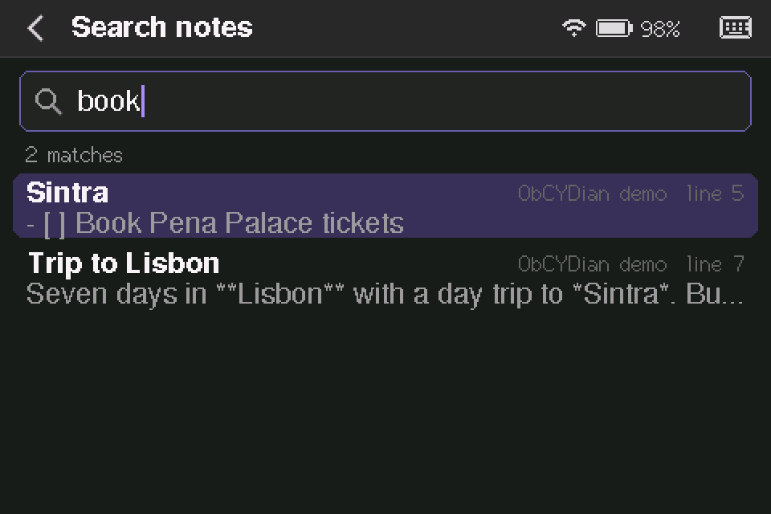 |
| File browser | Full-text search |
| 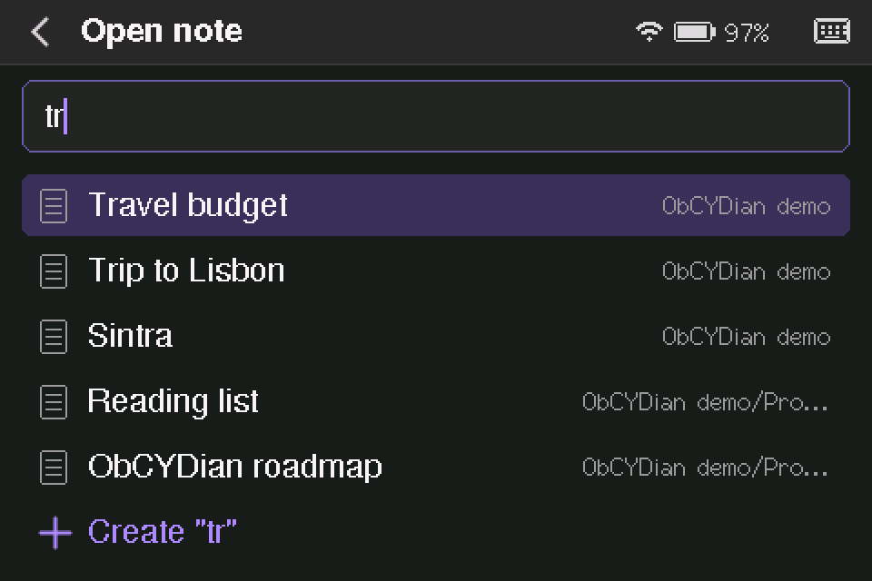 | 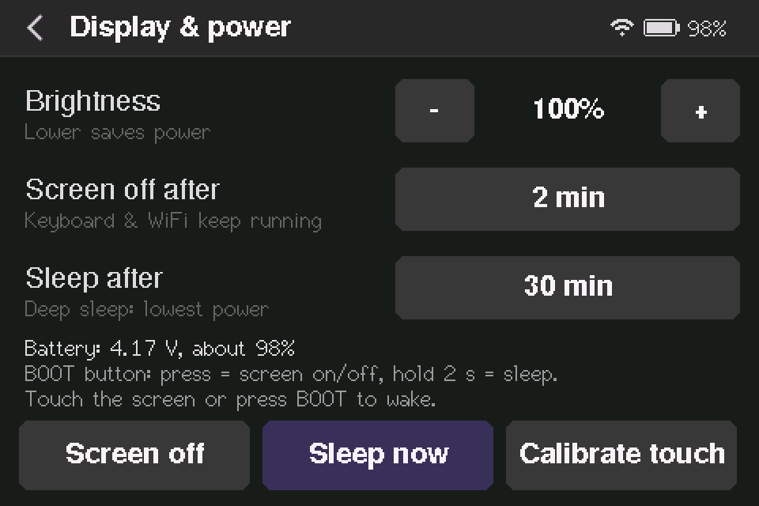 |
| Quick switcher (Ctrl+O) | Display & power settings |

**In the browser** (WiFi mode)

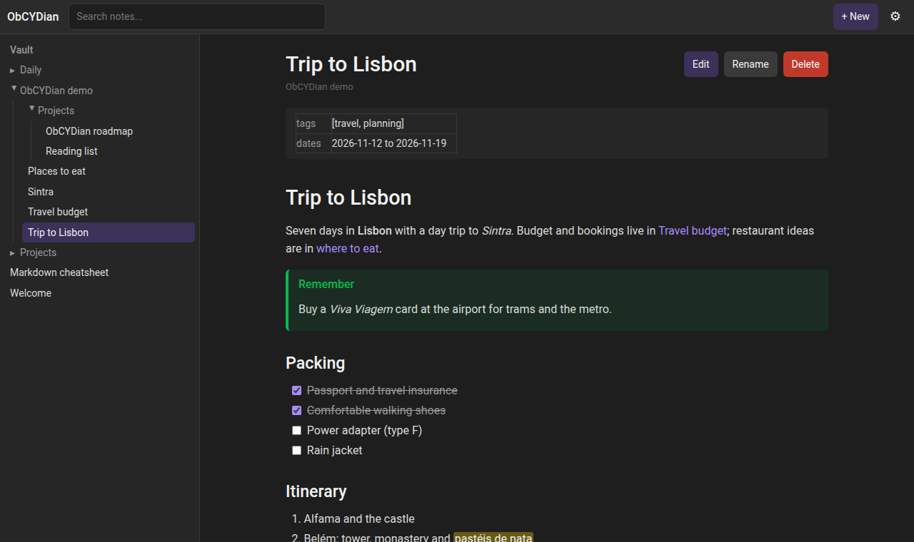

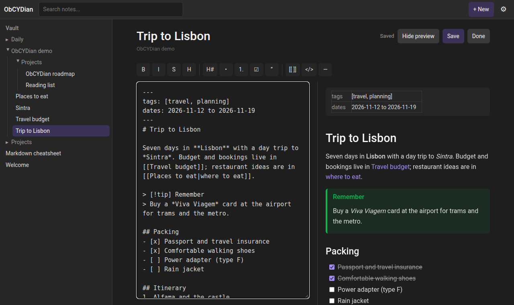

| | |
|---|---|
| 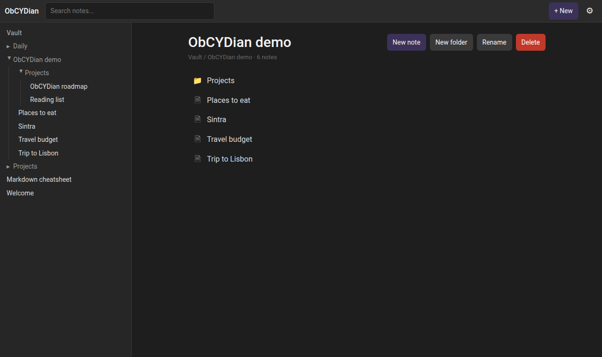 | 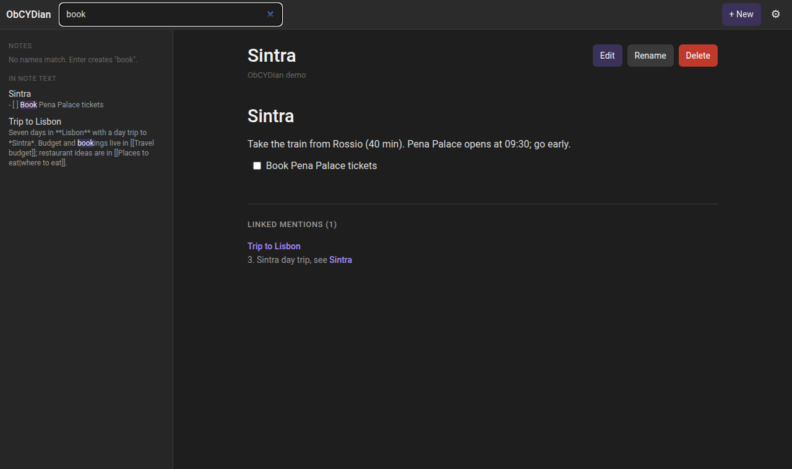 |
| Folder page | Search inside notes, with backlinks below the note |

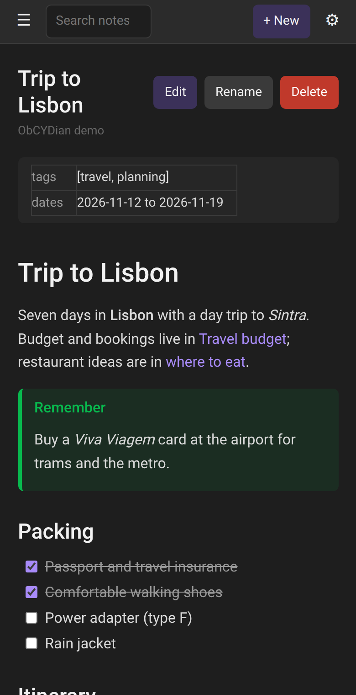

## Features

**Notes**
- A vault of markdown files and folders on the microSD card, compatible with Obsidian. You can copy a vault back and forth.
- `[[Wikilinks]]` resolve the way Obsidian does: by name, `[[Folder/Note]]`, `[[Note|alias]]` and `[[Note#Heading]]`. Links to missing notes are shown faded, and following one creates the note.
- Renaming or moving a note or folder updates the links that point to it.
- Search covers note names (quick switcher) and full note text.
- **Command palette** (Ctrl+P; also the ⋮ menu) with commands for the current note or folder.
- **Outline** (jump to a heading), **backlinks**, **tags** (inline and frontmatter), and **open tasks** across the vault that you can tick off from the list.
- **Bookmarks** and **recent notes** (stored in `/.obcydian/`).
- **Templates** from `/Templates`, with `{{title}}`, `{{date}}`, `{{time}}` and `{{date:FORMAT}}` filled in.
- **Daily notes** (Ctrl+D) in `/Daily/YYYY-MM-DD.md`, created from `Templates/Daily.md` if it exists. The board has no battery-backed clock: it gets the time from the internet in WiFi mode, or from the browser when the web app is open, keeps it through deep sleep, and asks for the date if it isn't set.
- `%%comments%%` are hidden, and frontmatter `aliases:` work in links and the quick switcher.
- **Images** on their own line (`![[photo.jpg]]`, `![[photo.jpg|300]]`, ``) are drawn from the card (JPEG, PNG, BMP), scaled to fit.
- **Embeds** on their own line (`![[Note]]`, `![[Note#Heading]]`) show the start of that note or section as a card; tap it to open the note.
- **Light and dark themes** (Settings → Display & power).

**Editor**
- Live preview, like Obsidian: formatting is rendered as you type, and the markdown syntax only shows on the line you're editing. There's also a reading view.
- Supports headings, bold, italic, strikethrough, `==highlight==`, inline code and code blocks, lists, tasks (tap to tick), quotes, callouts (`> [!tip]`), `#tags`, tables, rules and frontmatter.
- Lists continue when you press Enter. Tab and Shift+Tab indent and outdent. Undo/redo, a clipboard and `[[` link autocomplete are built in.
- Saves automatically to the card. Each save is atomic, so a power cut can't leave a half-written note.
- Text can include accented Latin letters, Greek, Cyrillic, typographic punctuation, currency signs, arrows and maths symbols.

**Input**
- **Bluetooth LE keyboard** (HID over GATT). It pairs once and reconnects automatically. Obsidian shortcuts work: Ctrl/Cmd+O, N, S, B, I, K, L and E, plus F2.
- **On-screen keyboard** with pages for symbols and accented letters.
- **Touch** to scroll, tap links and tick checkboxes.

**WiFi web app**
- In WiFi mode the device serves the vault as a web app at `http://obcydian.local/`.
- The web app has a file tree, search, rendered notes, backlinks, a markdown editor (toolbar, live preview, link autocomplete) and folder management.
- **Graph view**: the interactive link graph of the whole vault, or of one note's neighbourhood.
- **Backup**: download the whole vault as a .zip, and upload files or folders into it.
- With no WiFi configured, it creates a setup network with a captive portal. The screen shows a QR code to join it.

**Sync with Obsidian**
- In WiFi mode the device also runs a WebDAV server on port 8080, so Obsidian on a computer or phone can sync with it using the [Remotely Save](https://github.com/remotely-save/remotely-save) plugin.
- In Remotely Save, choose **WebDAV**, set the address to `http://<device IP>:8080`, and leave the username and password empty. Leave the remote folder at its default (the vault name); the device maps it onto the root of the card.
- On phones, use the numeric IP address: `.local` names often don't resolve there.
- There is no password, so anyone on your network can read and change the vault while WiFi mode is on.

**Device**
- Bluetooth and WiFi are mutually exclusive, to keep enough RAM free. Switch between them from the top-bar quick menu (tap the battery icon); the device restarts to change.
- Battery indicator. The screen turns off after a set idle time, and the device then goes into deep sleep. Touch the screen or press BOOT to wake it; it reopens the note you were on.
- Settings can format the SD card, recalibrate the touchscreen, and adjust brightness and the idle timers.

## Hardware

This targets the LCDWiki **3.5" ESP32-32E** board (E32R35T / E32N35T):

| Part | Details |
|---|---|
| MCU | ESP32-32E (ESP32-D0WD-V3, 4 MB flash, no PSRAM) |
| Display | 3.5" 320×480 ST7796 on HSPI (SCK 14, MOSI 13, MISO 12, CS 15, DC 2, backlight 27) |
| Touch | XPT2046 resistive, on the same SPI bus (CS 33, IRQ 36) |
| microSD | VSPI (SCK 18, MOSI 23, MISO 19, CS 5) |
| Battery | Sense divider on GPIO 34 (reads half the battery voltage) |
| USB | CH340 USB-serial (Type-C) |

The pin map is in [`src/board.h`](src/board.h). Other CYD variants should work once that file is adjusted.

Any FAT32 or exFAT microSD card works. The app can also format the card for you.

## Building and flashing

You need [PlatformIO](https://platformio.org/):

```sh
pio run -e cyd35 -t upload      # build and flash
pio device monitor              # serial log at 921600 baud
```

`platformio.ini` points `upload_port` at the CH340's `/dev/serial/by-id/...` path. Change it for your machine.

On first boot the device asks you to calibrate the touchscreen. To redo it, hold BOOT while pressing RESET, or go to Settings → Display & power.

### Development tools

- `tools/cyd.py` drives the serial debug console from your computer. It can take screenshots, inject taps and keys, and run a raw keyboard mode so you can type on the device from your terminal:
  ```sh
  tools/cyd.py "open /Welcome.md" shot:welcome.png
  tools/cyd.py kbd
  ```
  [`src/debug_console.h`](src/debug_console.h) lists all the console commands.
- `tools/genfont.py` regenerates the extended-Unicode fonts in `src/fonts/` from GNU FreeFont. It needs `freetype-py`.
- `pio run -e btscan -t upload` flashes a diagnostic scanner that reports whether a keyboard uses Bluetooth LE or Classic. ObCYDian supports BLE keyboards.

## Using it

| Where | How |
|---|---|
| File browser | Tap to open. **⋮** opens new note/folder, rename and delete. The magnifier searches note text. The gear opens Settings. |
| Note | Opens in reading view. The pencil icon (or Enter / Ctrl+E) switches to editing, and the eye icon switches back. |
| Top bar status | Tap the battery/radio icon for the quick menu: switch between Bluetooth and WiFi, turn the screen off, or sleep. |
| BOOT button | Short press turns the screen off or on. Hold 2 seconds to deep-sleep. |

## Licence

ObCYDian is free software, released under the **GNU General Public License v3.0**. See [LICENSE](LICENSE).

It builds on:
- [LovyanGFX](https://github.com/lovyan03/LovyanGFX) (MIT / BSD-2-Clause)
- [SdFat](https://github.com/greiman/SdFat) (MIT)
- [NimBLE-Arduino](https://github.com/h2zero/NimBLE-Arduino) (Apache-2.0)
- The Arduino core for ESP32 (LGPL-2.1 / Apache-2.0)
- The fonts in `src/fonts/` are generated from [GNU FreeFont](https://www.gnu.org/software/freefont/) (GPLv3 with font exception).

ObCYDian is not affiliated with Obsidian.
